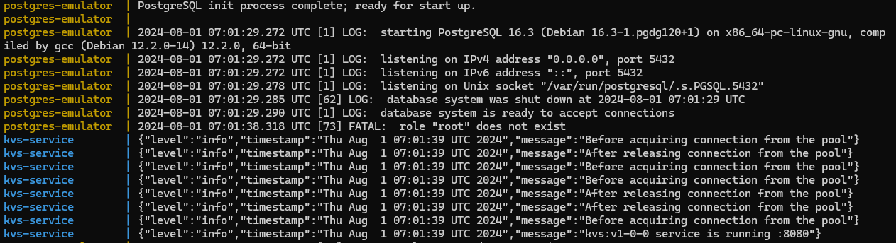

## Overview
KVS is a distributed key-value storage service written in Golang. Currently it supports storing POD data types, like integers, 32-bit floats, strings and hashmaps of type `map[string]string`, but I am planning to extend the functionality in the future and use it in my chat application as a replacement or alternative for a redis backend. The application is based around REST api and all the operations on a storage are done through the basic HTTP calls, which should be replaced with remote procedural calls using gRPC (it has a lot of room for improvements, which I left for myself, or for a reader, as an exercise). The architecutre document will be added as soon as I find the time for it.

## Running KVS service
Running key-value storage service is very straightforward and only requires [Docker](https://www.docker.com/products/docker-desktop/) to be installed on your machine. Once that is done, run `docker compose up` inside a root directory. That will spin up two docker containers, the first one running `PostgreSQL` database, and the second one running our key-value storage application. Everything is configured inside a docker [compose.yaml](https://github.com/isnastish/kvs/blob/master/compose.yaml) file.
If you see these logs as a result of executing the command above, you have done everything correctly and your kvs service is up and running together with PostgreSQL database for handling transactions.

## Testing the api
